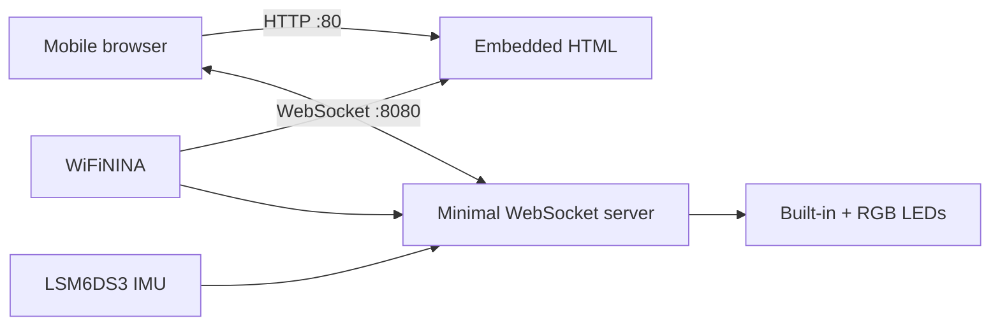

# WebSocket WiFi Rev2

A self-contained, browser-controlled hardware demonstration for the Arduino Uno WiFi Rev2. The board creates its own Wi-Fi access point, serves an embedded HTML interface, and exchanges real-time control and sensor data with a phone over WebSockets—without an installed application or external server.

The project implements the WebSocket handshake and framing directly because a general-purpose WebSocket library did not fit alongside Wi-Fi, HTTP, and IMU support in the Uno WiFi Rev2's available program storage.

> **Status:** Working hardware prototype, originally developed in 2021 and rebuilt and tested on new hardware in 2026.

## What it demonstrates

- A minimal RFC 6455 WebSocket implementation on a memory-constrained microcontroller
- HTTP and WebSocket servers running concurrently on an Arduino Uno WiFi Rev2
- A complete HTML and JavaScript interface served from microcontroller flash
- Two-way, real-time communication with an ordinary mobile browser
- Binary transmission of accelerometer, gyroscope, and temperature measurements
- Browser control of the built-in LED and the Wi-Fi module's RGB LED
- Standalone access-point operation for a portable, phone-only demonstration
- Optional station mode using DHCP on an existing Wi-Fi network

## Verified configuration

The current version was compiled, uploaded, and exercised on an Arduino Uno WiFi Rev2 with:

| Component | Version |
| --- | --- |
| WiFiNINA | 2.1.1 |
| Arduino_SpiNINA | 0.0.2, installed as a WiFiNINA dependency |
| Arduino_LSM6DS3 | 1.0.3 |

Arduino IDE reported:

```text
Sketch uses 47796 bytes (98%) of program storage space. Maximum is 48640 bytes.
Global variables use 870 bytes (14%) of dynamic memory, leaving 5274 bytes for local variables. Maximum is 6144 bytes.
```

Access-point mode and all interface functions were verified from a Samsung phone using DuckDuckGo Browser:

- Connected to the Arduino-hosted Wi-Fi network
- Loaded the embedded page from `http://192.168.4.1`
- Established the WebSocket connection on port 8080
- Controlled the built-in and RGB LEDs
- Received accelerometer, gyroscope, and temperature telemetry

This provides a self-contained demonstration: the board and a phone can be carried together and operated without internet access, a laptop, a native application, or additional network infrastructure.

## Architecture



The HTTP server returns the interface stored in `webpage.h`. JavaScript on the page connects back to the same device on WebSocket port 8080. Short text commands carry LED state and RGB values to the Arduino; fixed-length binary frames carry the current output state and seven floating-point IMU values back to the browser.

## Hardware

- Arduino Uno WiFi Rev2
- USB cable for programming and power
- Wi-Fi-capable phone, tablet, or computer

No external sensors or LEDs are required. The demonstration uses hardware already present on the board.

## Arduino IDE setup

1. Install the **Arduino megaAVR Boards** platform and select **Arduino Uno WiFi Rev2** as the target board.
2. Open **Tools → Manage Libraries**.
3. Install **WiFiNINA 2.1.1**. The Library Manager also installs **Arduino_SpiNINA 0.0.2**.
4. Install **Arduino_LSM6DS3 1.0.3**.
5. Open `WebSocket_WiFiRev2.ino` in the Arduino IDE.

Newer compatible library versions may also work, but the versions above are the configuration that has been verified.

## Configure credentials

Copy the example configuration before compiling:

```sh
cp arduino_secrets.example.h arduino_secrets.h
```

`arduino_secrets.h` is ignored by Git so station-mode credentials are not accidentally committed.

The example configuration starts the Arduino as a password-protected access point:

```cpp
#define IS_ACCESS_POINT 1
#define SECRET_SSID "ARDUINOWIFI"
#define SECRET_PASS "ARDUINOWIFI"
```

The Wi-Fi password must contain at least eight characters.

## Run the portable demonstration

1. Compile and upload the sketch.
2. On the phone, join the `ARDUINOWIFI` network using password `ARDUINOWIFI`.
3. The phone may warn that the network has no internet connection; remain connected to it.
4. Browse to [http://192.168.4.1](http://192.168.4.1).
5. Wait for the page status to change from **Disconnected** to **Connected**.
6. Move the RGB sliders, toggle the LED, and move the board to observe the live sensor values.

The browser downloads the interface directly from the Arduino. After the initial page load, JavaScript automatically opens:

```text
ws://192.168.4.1:8080/
```

## Station mode

To connect the board to an existing Wi-Fi network instead of creating an access point, edit `arduino_secrets.h`:

```cpp
#define IS_ACCESS_POINT 0
#define SECRET_SSID "your-network-name"
#define SECRET_PASS "your-network-password"
```

After startup, the serial monitor prints the DHCP-assigned address. Browse to that address from another device on the same network. Station mode is supported by the code, but the 2026 hardware verification described above focused on the portable access-point demonstration.

## WebSocket implementation

The sketch contains the small subset of WebSocket functionality needed by the embedded page:

- HTTP Upgrade handshake
- `Sec-WebSocket-Key` processing
- SHA-1 and Base64 generation of `Sec-WebSocket-Accept`
- Decoding masked client frames
- Text commands from the browser
- Binary telemetry frames from the Arduino

The implementation is intentionally application-specific rather than a general-purpose WebSocket library. It supports one WebSocket client, short unfragmented messages, and the protocol behavior needed by the bundled interface. It does not provide TLS, WebSocket extensions, large payload handling, or production-grade protocol validation.

Use it on a trusted local or device-hosted network. It is a compact hardware interface and engineering demonstration, not an internet-facing service.

## Binary telemetry frame

The Arduino sends a 32-byte binary WebSocket payload:

| Offset | Size | Value |
| ---: | ---: | --- |
| 0 | 1 byte | Red LED value |
| 1 | 1 byte | Green LED value |
| 2 | 1 byte | Blue LED value |
| 3 | 1 byte | Built-in LED state |
| 4 | 4 bytes | Acceleration X |
| 8 | 4 bytes | Acceleration Y |
| 12 | 4 bytes | Acceleration Z |
| 16 | 4 bytes | Gyroscope X |
| 20 | 4 bytes | Gyroscope Y |
| 24 | 4 bytes | Gyroscope Z |
| 28 | 4 bytes | IMU temperature |

The sensor fields are AVR `float` values and are interpreted by the bundled page with JavaScript `Float32Array`.

## Repository guide

| File | Purpose |
| --- | --- |
| `WebSocket_WiFiRev2.ino` | Wi-Fi, HTTP, WebSocket, LED, and IMU application |
| `webpage.h` | Self-contained browser interface embedded in flash |
| `arduino_secrets.example.h` | Example AP/station configuration |
| `cencode.c`, `cencode_inc.h` | Public-domain Base64 implementation |
| `libsha1.c`, `libsha1.h` | Public-domain SHA-1 implementation used by the handshake |

## License

The project is released under the MIT License. See `LICENSE`.

The bundled Base64 and SHA-1 implementations retain their original public-domain notices in their source files.
